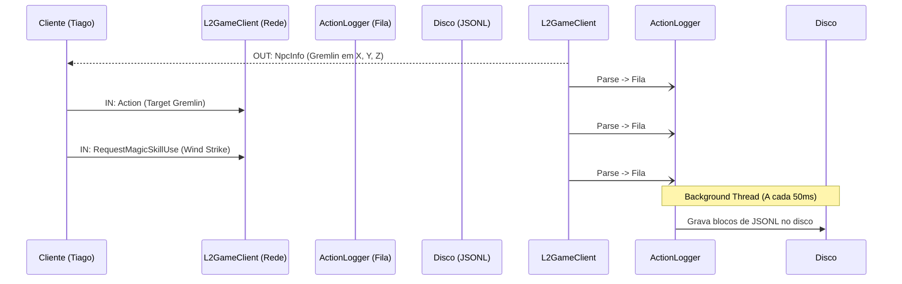

# Design Técnico: Logger de Ações em JSON (JSON Lines)

## Arquitetura de Interceptação

Para evitar a quebra de performance do GameServer e capturar os pacotes no formato mais puro e útil, a arquitetura será dividida em 3 camadas:

### 1. Camada de Interceptação (Network Layer)
Vamos atuar diretamente onde os pacotes são recebidos e enviados pelo `L2GameClient` (ou o pipeline do Netty/NIO dependendo da versão do L2J).
- **Pacotes de Entrada (IN):** Capturados no momento em que o `IClientIncomingPacket` é decodificado e o método `readImpl()` (ou similar) é executado, mas *antes* de rodar a lógica do jogo (`runImpl()`).
- **Pacotes de Saída (OUT):** Capturados assim que o servidor gera o `IServerOutgoingPacket` e chama `writeImpl()`.

### 2. Camada de Extração e Serialização (Payload Parser)
Como o L2J não salva as variáveis do pacote em memória por padrão (ele lê os bytes e joga direto pro jogo), precisaremos implementar uma interface `IAuditablePacket` nos pacotes que queremos monitorar.
- A interface terá um método `Map<String, Object> getAuditData()`.
- Uma fábrica transformará esse `Map` em uma string JSON leve (usando Gson ou Jackson).

### 3. Camada de Escrita Assíncrona (Async File Writer)
Nunca devemos escrever em disco na mesma thread de rede! 
- O JSON gerado é jogado para uma fila na memória (`ConcurrentLinkedQueue` ou via `Disruptor`).
- Uma thread em background dedicada (ex: `ActionLoggerThread`) consome essa fila continuamente e escreve no disco.
- Usaremos o formato **JSONL** (JSON Lines), onde cada linha do arquivo é um objeto JSON válido. Isso facilita muito a ingestão futura por ferramentas como Logstash/Kibana ou Splunk.

---

## Estrutura do Arquivo
Os arquivos serão organizados no disco por jogador e por dia:
`log/player_actions/2026-08-28/Tiago_20260828.jsonl`

---

## Exemplo do JSON Gerado

Aqui está um fluxo de como os dados aparecerão no arquivo (formatado aqui com quebras de linha para leitura, mas no arquivo real cada objeto ocupará apenas uma linha):

### 1. O Servidor diz para o Cliente que um NPC apareceu (OUT)
```json
{
  "timestamp": "2026-08-28T12:45:01.123Z",
  "charName": "Tiago",
  "direction": "OUT",
  "packet": "NpcInfo",
  "data": {
    "npcId": 20001,
    "objectId": 18273645,
    "x": -14200,
    "y": 123400,
    "z": -3100,
    "isAttackable": true
  }
}
```

### 2. O Cliente clica no NPC (IN)
```json
{
  "timestamp": "2026-08-28T12:45:02.500Z",
  "charName": "Tiago",
  "direction": "IN",
  "packet": "Action",
  "data": {
    "targetObjectId": 18273645,
    "originX": -14228,
    "originY": 123445,
    "originZ": -3115,
    "shiftPressed": false
  }
}
```

### 3. O Cliente tenta usar uma Skill no NPC (IN)
```json
{
  "timestamp": "2026-08-28T12:45:03.100Z",
  "charName": "Tiago",
  "direction": "IN",
  "packet": "RequestMagicSkillUse",
  "data": {
    "skillId": 1230,
    "skillLevel": 1,
    "ctrlPressed": false,
    "shiftPressed": false
  }
}
```

### 4. O Servidor informa que a skill causou dano e o NPC morreu (OUT)
```json
{
  "timestamp": "2026-08-28T12:45:03.650Z",
  "charName": "Tiago",
  "direction": "OUT",
  "packet": "SystemMessage",
  "data": {
    "messageId": 2261,
    "messageParams": ["Tiago", 1500, "Gremlin"]
  }
}
```

---

## Visualização Gráfica do Fluxo



---

## Desafios de Implementação (Para avaliarmos)
1. **Quais pacotes ignorar?** Devemos logar o pacote de movimento (`MoveBackwardToLocation`)? Ele é disparado a cada clique no chão e pode inflar o log em gigabytes muito rápido.
2. **Refatoração dos Pacotes:** Teremos que modificar a classe base `ServerPacket` e `ClientPacket` para abstrair o `getAuditData()`, e implementar esse método em cada um dos ~100 pacotes cruciais que quisermos monitorar.

---

## Arquivo de Configuração (Filtro Dinâmico)

Como a principal motivação é monitorar jogadores específicos (ou bots sendo testados) e fornecer dados para aplicações externas, capturar *todos* os jogadores o tempo todo é desnecessário e custoso.

Para gerenciar isso, criaremos um arquivo de configuração (ex: `config/player_audit.ini`) lido em tempo de execução. Ele permitirá ligar/desligar a escuta sem precisar reiniciar o servidor.

### Estrutura Sugerida (`player_audit.ini`)
```ini
# Ativa ou desativa completamente o sistema de Auditoria
AuditEnabled = True

# Modo de Auditoria:
# ALL = Audita todos os jogadores logados (Cuidado com performance!)
# LIST = Audita apenas os jogadores listados em AuditPlayerList
AuditMode = LIST

# Lista de jogadores a serem auditados (separados por vírgula)
# Útil para colocar o nome do Bot que estamos configurando ou de um player suspeito
AuditPlayerList = Tiago, TestBot1, FakeShop_Giran

# Ignorar pacotes de movimento contínuo para economizar espaço? (Recomendado: True)
IgnoreMovementPackets = True

# Diretório de saída dos arquivos JSONL
AuditOutputDirectory = log/player_actions/
```

### Como a engine aplicará a configuração:
- Quando o `L2GameClient` receber ou enviar um pacote, ele verificará `Config.AUDIT_ENABLED`.
- Em seguida, verificará se o `activeChar.getName()` está contido no `HashSet` carregado de `AuditPlayerList`.
- A verificação de nome deve ser extremamente rápida (usando Hashing/Sets em memória) para adicionar o menor *overhead* possível a cada pacote processado.
